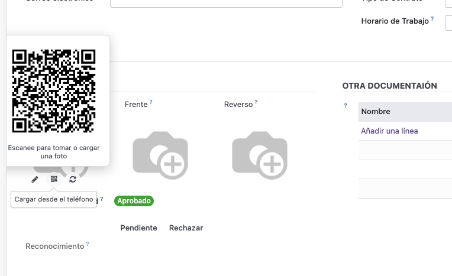
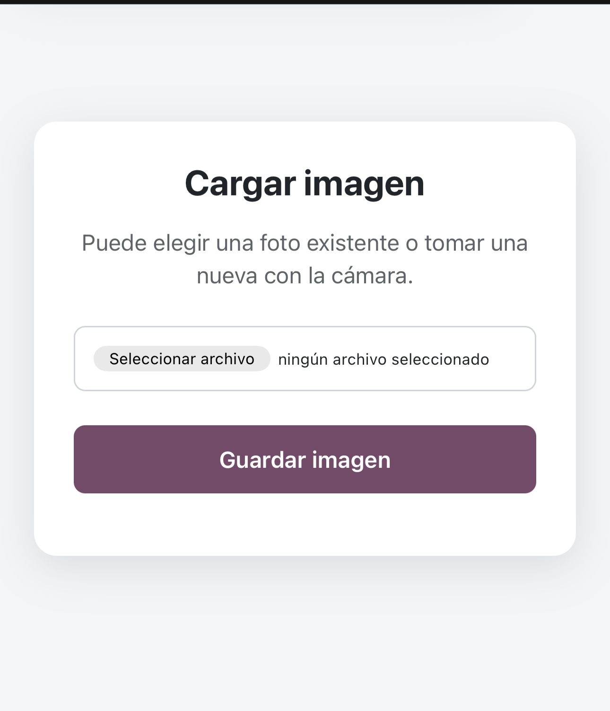

# Libra Web Image QR

Extensión del widget de imagen de Odoo 16 que permite cargar fotografías desde
un teléfono mediante un código QR.

El módulo se integra globalmente con los campos que utilizan `widget="image"`.
No es necesario modificar las vistas existentes.

## Funcionalidades

- Agrega un botón QR junto al botón de edición del widget de imagen.
- Permite seleccionar una imagen existente o tomar una fotografía desde el teléfono.
- Incluye un botón para actualizar manualmente la imagen sin recargar la página.
- Actualiza automáticamente la imagen mediante el bus de notificaciones de Odoo.
- No realiza consultas periódicas al servidor.
- Oculta los controles de carga QR cuando el campo es de solo lectura.
- Genera enlaces QR de un solo uso, sin vencimiento temporal.
- Invalida el enlace inmediatamente después de una carga exitosa.
- Genera un QR nuevo cuando se necesita volver a reemplazar la imagen.
- Valida el contenido, formato y tamaño del archivo recibido.
- Muestra un indicador de carga y evita envíos duplicados desde el teléfono.

## Formatos y límites

Formatos admitidos:

- JPEG
- PNG
- GIF
- WebP

El tamaño máximo permitido es de 15 MB.

## Requisitos

- Odoo 16.0
- Módulos `web` y `bus`
- Paquetes de Python `qrcode` y `Pillow`
- HTTPS para el uso normal de la cámara en navegadores móviles

Las imágenes de Docker oficiales de Odoo suelen incluir Pillow. Si `qrcode` no
está disponible en el entorno, puede instalarse con:

```bash
pip install qrcode[pil]
```

## Instalación

1. Copiar `libra_web_image_qr` dentro de una ruta incluida en `addons_path`.
2. Reiniciar Odoo.
3. Actualizar la lista de aplicaciones.
4. Instalar **Libra Web Image QR**.

También puede instalarse desde la línea de comandos:

```bash
odoo -d nombre_base -i libra_web_image_qr --stop-after-init
```

## Configuración

El parámetro del sistema `web.base.url` debe contener una dirección accesible
desde el teléfono que escaneará el QR.

Ejemplo:

```text
https://odoo.example.com
```

Direcciones como `localhost` o `127.0.0.1` no funcionarán desde otro dispositivo.
Si Odoo se encuentra detrás de un proxy inverso, configure correctamente HTTPS,
los encabezados de proxy y `proxy_mode`.

El bus de Odoo debe estar operativo para recibir la actualización automática.
Si se utiliza una instalación con workers, el proxy debe dirigir `/websocket` al
puerto gevent configurado en Odoo.

## Uso

### 1. Generar y escanear el QR

Al posicionar el cursor sobre el icono QR se muestra el código correspondiente
al campo de imagen:



### 2. Seleccionar o tomar una fotografía

Después de escanear el código, el teléfono abre la página de carga. Desde allí
se puede elegir una imagen existente o utilizar la cámara:



### 3. Guardar y actualizar la imagen

1. Abrir un registro guardado que tenga un campo con `widget="image"`.
2. Posicionar el cursor sobre el icono QR.
3. Escanear el código desde el teléfono.
4. Elegir una imagen o tomar una fotografía.
5. Pulsar **Guardar imagen**.

Al finalizar, Odoo recibe una notificación y vuelve a cargar la imagen. El botón
de actualización puede utilizarse como alternativa manual. Después de una carga
exitosa, el QR queda invalidado; al solicitarlo nuevamente se genera otro enlace.

Los registros nuevos deben guardarse antes de generar un QR, ya que el enlace
necesita un modelo, un identificador de registro y un campo de destino.

## Seguridad

- La creación del enlace comprueba permisos de escritura y reglas de registro.
- Los usuarios internos sólo pueden consultar sus propios tokens.
- El QR contiene un token aleatorio de alta entropía y no expone directamente
  el modelo, registro ni campo de destino.
- Los enlaces no vencen por tiempo, pero sólo admiten una carga exitosa.
- Después de guardar una imagen, el token queda invalidado y no puede reutilizarse.
- El archivo se verifica como una imagen real antes de almacenarlo.

Mientras no haya sido utilizado, quien posea el enlace puede reemplazar la imagen
del campo autorizado. Por ese motivo, el QR debe tratarse como una credencial
privada y no debe publicarse ni compartirse fuera del flujo previsto.

## Estructura

```text
libra_web_image_qr/
├── controllers/       # Página móvil, recepción de archivos y generación del QR
├── models/            # Tokens temporales y escritura de la imagen
├── security/          # Accesos y regla de tokens por usuario
├── static/src/        # Extensión OWL del widget image y estilos
└── views/             # Plantilla de la página móvil
```

## Compatibilidad

El módulo reemplaza el registro frontend de `image` y `kanban.image` conservando
el comportamiento original de `ImageField`. Si otro módulo reemplaza globalmente
los mismos widgets, el resultado dependerá del orden de carga de los assets.

## Licencia

Este proyecto se distribuye bajo la licencia
[LGPL-3.0](https://www.gnu.org/licenses/lgpl-3.0.html), de acuerdo con el
manifest del módulo.

## Autor

[Librasoft](https://www.libra-soft.com)
